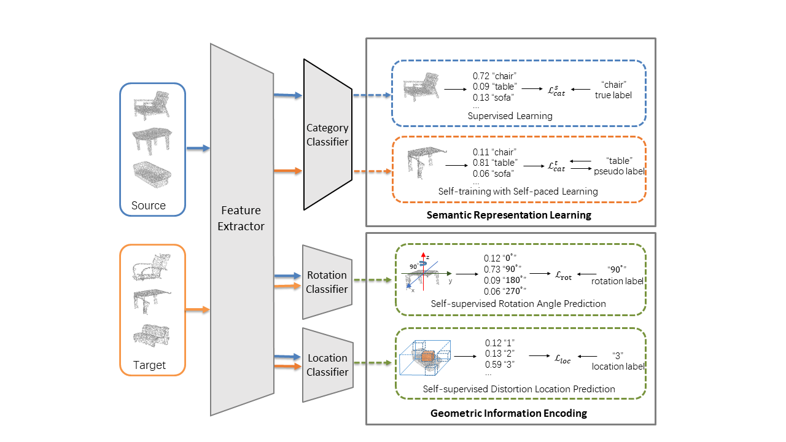
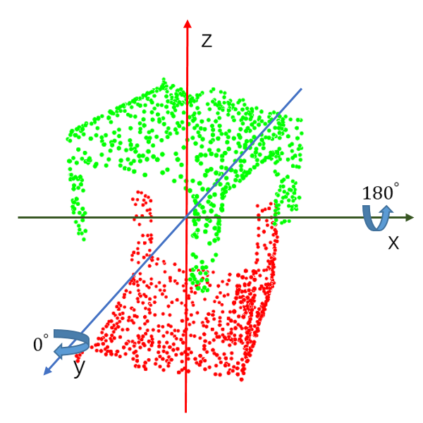
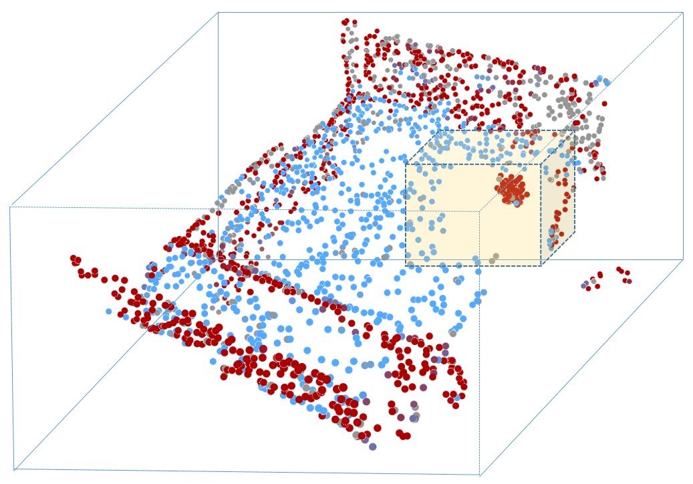

# Geometry-Aware Self-Training for Unsupervised Domain Adaptation Object Point Clouds 

<p align="center"> 
    
</p> 
 
 ### Introduction
The point cloud representation of an object can have a large geometric variation in view of inconsistent data acquisition procedure, which thus leads to domain discrepancy due to diverse and uncontrollable shape representation cross datasets. To improve discrimination on unseen distribution of point-based geometries in a practical and feasible perspective, this paper proposes a new method of geometry-aware self-training (GAST) for unsupervised domain adaptation of object point cloud classification. Specifically, this paper aims to learn a domain-shared representation of semantic categories, via two novel self-supervised geometric learning tasks as feature regularization. On one hand, the representation learning is empowered by a linear mixup of point cloud samples with their self-generated rotation labels, to capture a global topological configuration of local geometries. On the other hand, a diverse point distribution across datasets can be normalized with a novel curvature-aware distortion localization. Experiments on the PointDA-10 dataset show that our GAST method can significantly outperform the state-of-the-art methods.

[[Paper]](https://arxiv.org/pdf/2108.09169.pdf)

### Instructions
Clone repo and install it
```bash
git clone https://github.com/zou-longkun/gast.git
cd gast
pip install -r requirements.txt
```

Download data:
```bash
cd ./data
python download.py
```

Prepare data:
```bash
cd ./data
python download.py

python compute_norm_curv.py  # In line 149, note that the point number of pointcloud in shapenet is 1024, and in modelnet is 2048
python compute_norm_curv_scannet.py 
```


Run GAST on both source and target
```
python train_Norm.py 
Then
python train_SPST.py
```


### Citation
Please cite this paper if you want to use it in your work,
```
@inproceedings{zou2021geometry,
  title={Geometry-Aware Self-Training for Unsupervised Domain Adaptation on Object Point Clouds},
  author={Zou, Longkun and Tang, Hui and Chen, Ke and Jia, Kui},
  booktitle={Proceedings of the IEEE/CVF International Conference on Computer Vision},
  pages={6403--6412},
  year={2021}
}
```
 
### Rotation Angle and Distortion Location prediction
<p align="center"> 
    
    
</p> 
 
 
### Acknowledgement
Some of the code in this repoistory was taken (and modified according to needs) from the follwing sources:
[[PointNet]](https://github.com/charlesq34/pointnet), [[PointNet++]](https://github.com/charlesq34/pointnet2), [[DGCNN]](https://github.com/WangYueFt/dgcnn), [[PointDAN]](https://github.com/canqin001/PointDAN), [[Reconstructing_space]](http://papers.nips.cc/paper/9455-self-supervised-deep-learning-on-point-clouds-by-reconstructing-space), [[Mixup]](https://github.com/facebookresearch/mixup-cifar10),[[DefRec]](https://github.com/idanachi/DefRec_and_PCM.git)


